# Practica 2 Grupo 37

***
#### Integrantes
|   Carné   |               Nombre              |
| --------- | --------------------------------- |
| 201500332 | Gabriela Xiomara Raymundo Barrios |
| 201700532 | Milton Josue Villeda Gómez        |
| 201503378 | Escarleth Andrea Velasco Campos   |

***

## Topología 1: Servidores

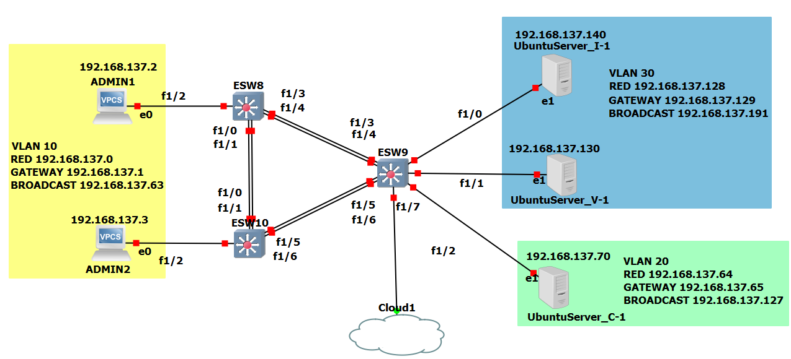

- ## Equipos

- admin 1 (vpc)
- admin 2 (vpc)
- Ventas  (máquina virtual)
- Contabilidad (máquina virtual)
- Informatica (máquina virtual)

## Vlans utilizadas 

- Informática: 30
- Contabilidad: 30
- Ventas: 20
- Administrador: 10

## Configuración de los switches capa 3

### Sw 8

- Po1 y  Po3

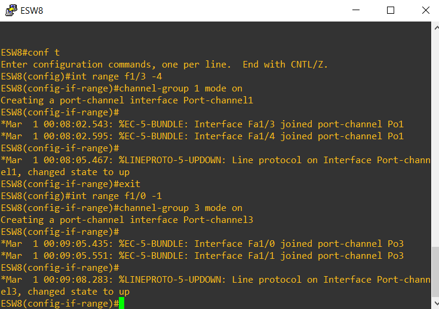

Las interfaces f1/ 0-1 se configuran en el port channel 3, mientras que los f1/ 3-4 se configuran en el port channel 1

- Mode trunk

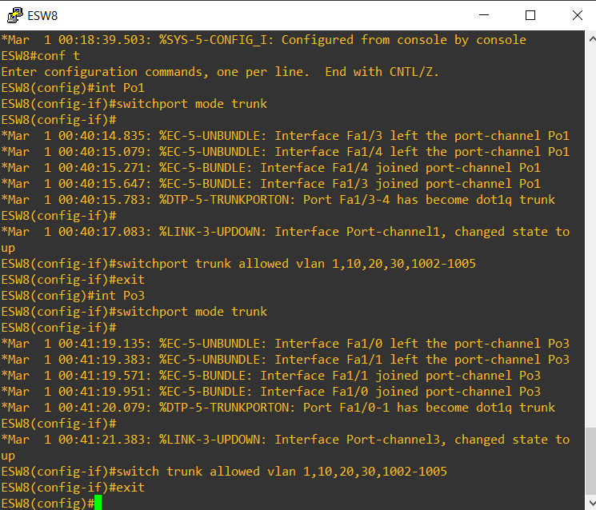

Los port channel Po1 y Po3 se configuran en modo troncal, permitiendo las vlan 1,10,20,30 y de la 1002-1005

- Mode Access

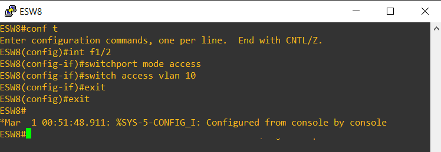

La interface fa1/2 se configura en modo acceso con la vlan de administrador

### Sw 9

- Po1 y  Po2

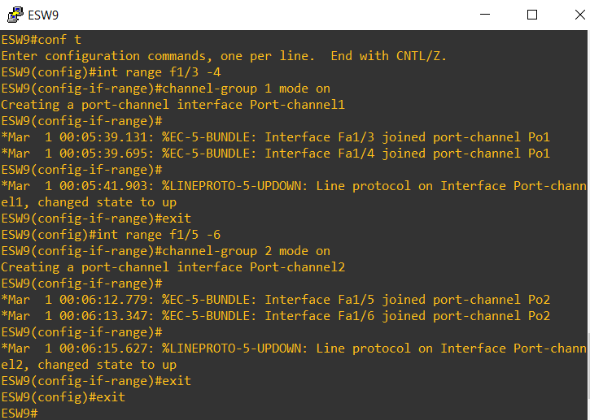

Las interfaces f1/ 0-1 se configuran en el port channel 3, mientras que los f1/ 5-6 se configuran en el port channel 1

- Mode trunk

Los port channel Po1 y Po2 se configuran en modo troncal, permitiendo las vlan 1,10,20,30 y de la 1002-1005

- Mode Access

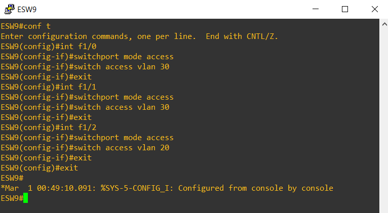

La interface fa1/0 se configura en modo acceso con la vlan de Informatica

La interface fa1/1 se configura en modo acceso con la vlan de Ventas

La interface fa1/2 se configura en modo acceso con la vlan de Contabilidad

### Sw 10

- Po2 y  Po3

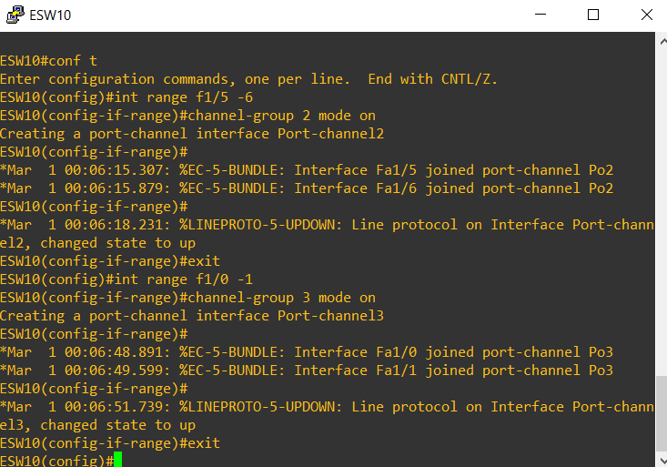

Las interfaces f1/ 5-6 se configuran en el port channel 3, mientras que los f1/ 3-4 se configuran en el port channel 1

- Mode trunk

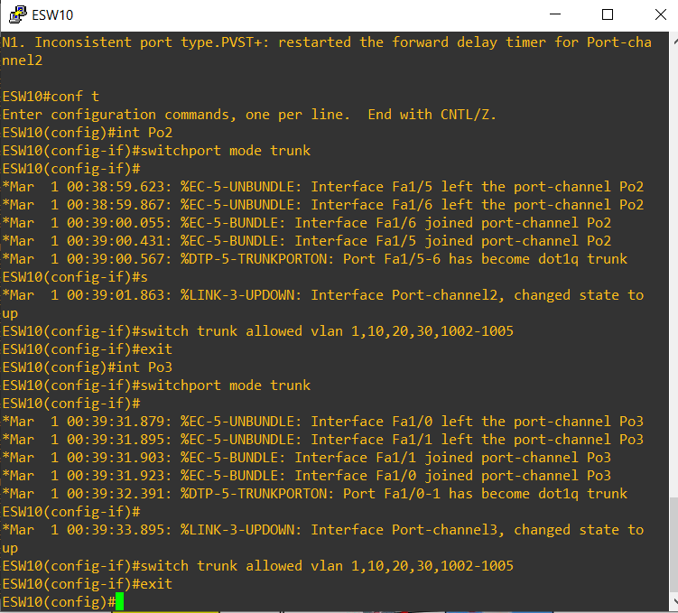

Los port channel Po2 y Po3 se configuran en modo troncal, permitiendo las vlan 1,10,20,30 y de la 1002-1005

- Mode Access

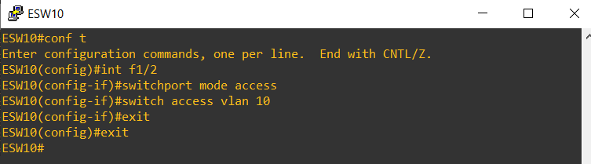

### VTP
para los tres switches se configuran la vtp 37
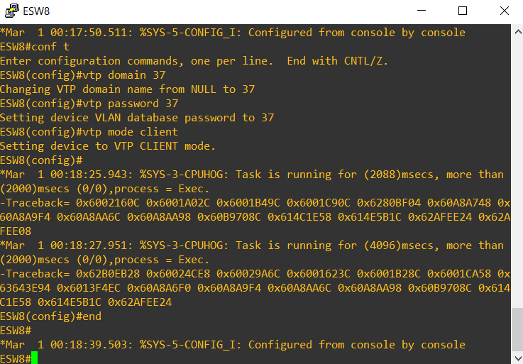

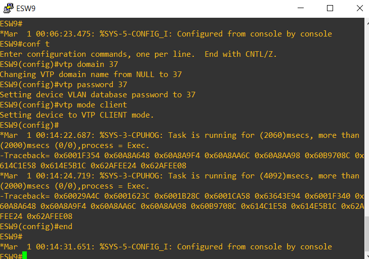

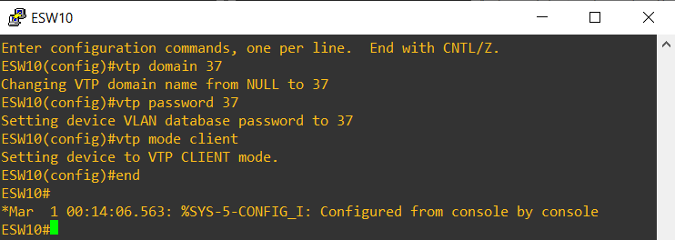

## Configuración de redes

- Administrador: 192.168.137.0/26
- Ventas: 192.168.137.64/26
- Informática 192.168.137.128/26
- Contabilidad 192.168.137.128/26

## Configuración Servidores

- IP Contabilidad : 192.168.137.70

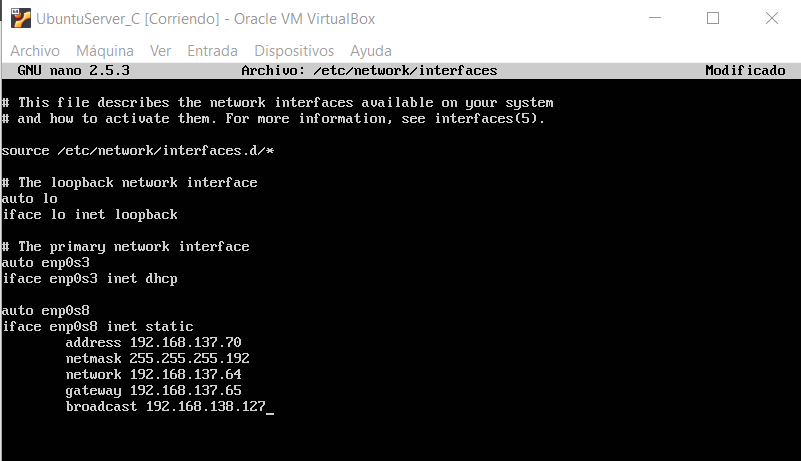

- IP Informatica : 192.168.137.140

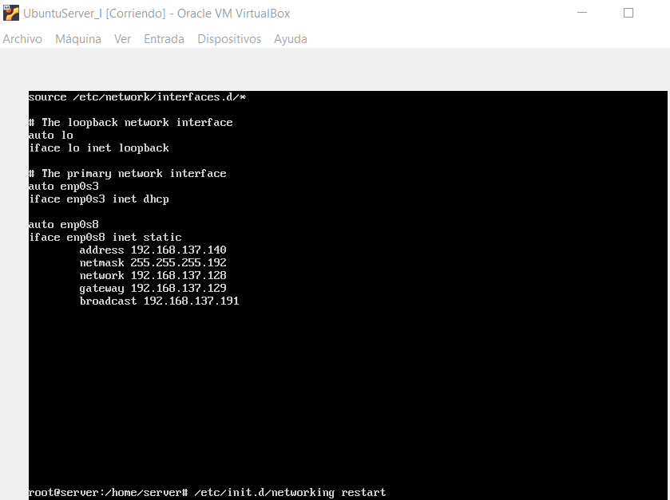

- IP Ventas : 192.168.137.130

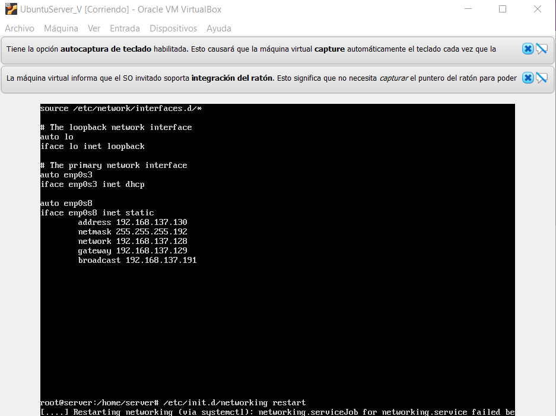

