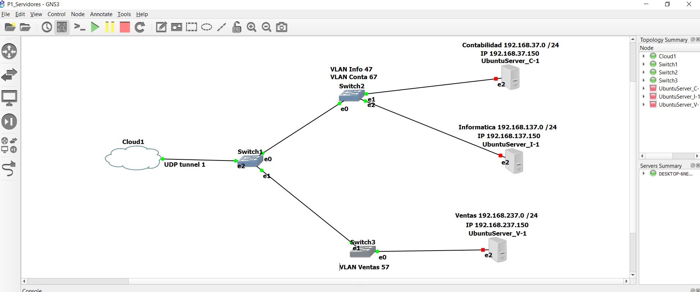
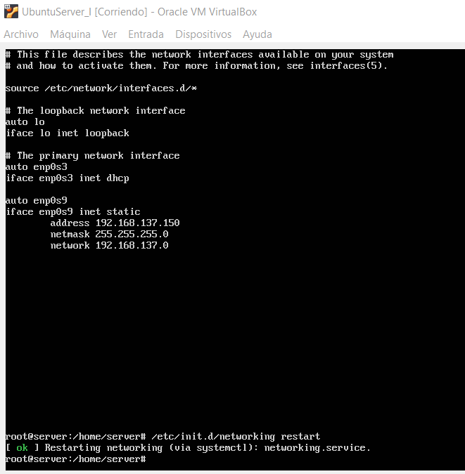
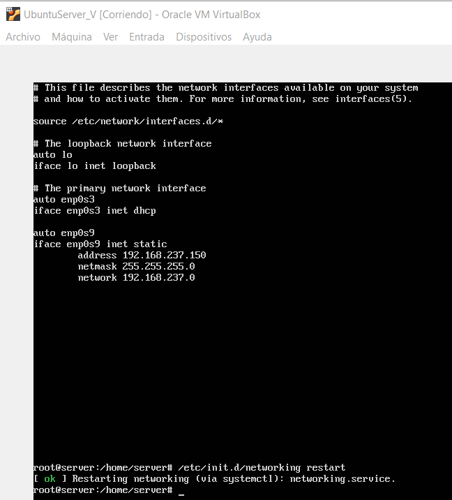
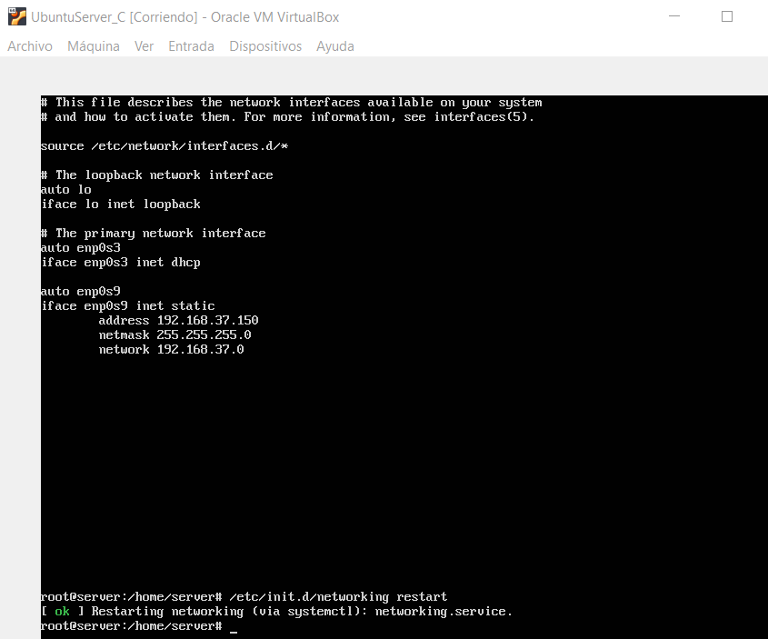
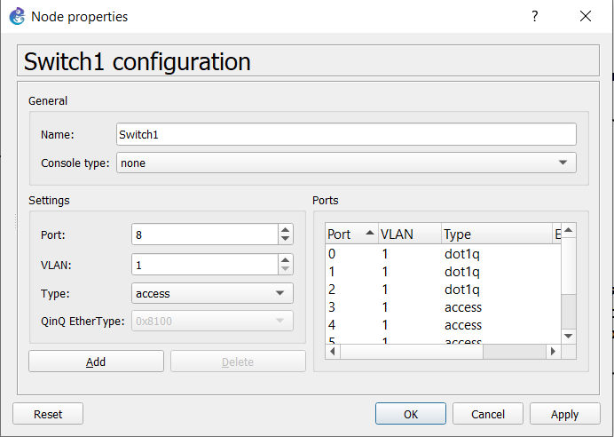
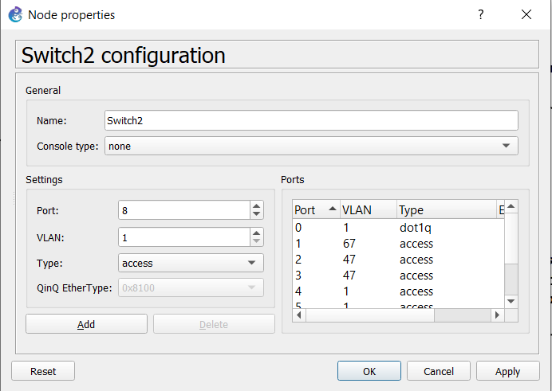
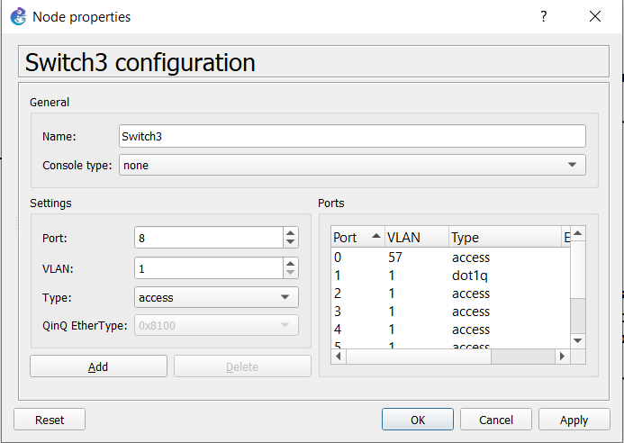
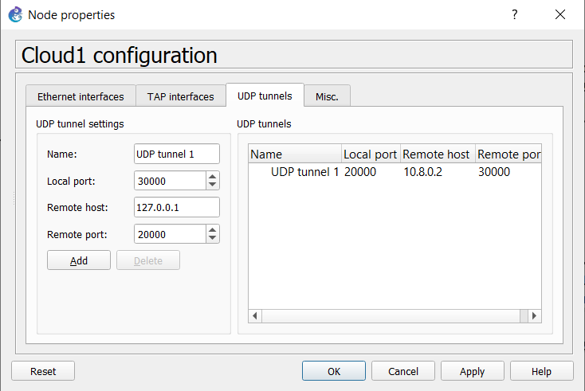

## Practica 1 Grupo 37

***
#### Integrantes
|   Carné   |               Nombre              |
| --------- | --------------------------------- |
| 201500332 | Gabriela Xiomara Raymundo Barrios |
| 201700532 | Milton Josue Villeda Gómez        |
| 201503378 | Escarleth Andrea Velasco Campos   |

***

## Topologia 2 

### Configuracion IP MAQUINAS VIRTUALES
Se accede al archivo de interfaces de red con el siguiente comando

    sudo nano /etc/network/interfaces

y se configura la ip, en el puerto dado 

#### VIRTUAL DE INFORMATICA

#### VIRTUAL DE VENTAS

#### VIRTUAL DE CONTABILIDAD

por ultimo se reincia el servicio de red con el comando

    sudo /etc/init.d/networking restart

***

### Configuracion de VLAN en SWITCHES

#### Switch 1
    - Puerto 0, se le deja la VLAN predeterminada con enlace troncal hacia el switch 2
    - Puerto 1, se le deja la VLAN predeterminada con enlace troncal hacia el switch 3
    - Puerto 2, se le deja la VLAN predeterminada con enlace troncal hacia la nube

#### Switch 2
    - Puerto 0, se le deja la VLAN predeterminada con enlace troncal hacia el switch 1
    - Puerto 1, modo acceso pues va hacia el servidor de Contabilidad, VLAN 67
    - Puerto 2, modo acceso pues va hacia el servidor de Informatica, VLAN 47

#### Switch 3
    - Puerto 0, modo acceso pues va hacia el servidor de Ventas, VLAN 57
    - Puerto 1, se le deja la VLAN predeterminada con enlace troncal hacia el switch 1

***

### Configuracion NUBE

    - Se utiliza el puerto 20000 para hacer conexion
    - El host al que se conectara es el 10.8.0.2
    - El puerto del host al que se conectara es el pueto 30000

