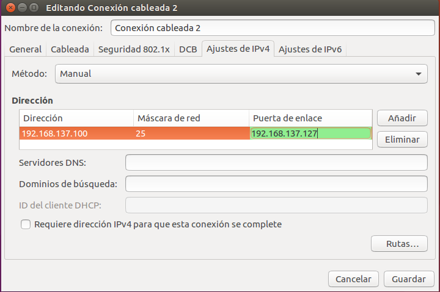
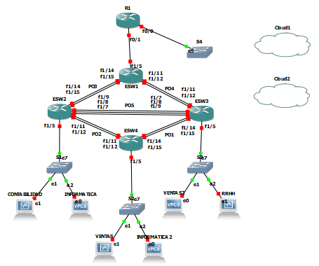
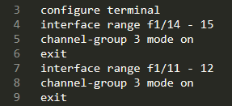
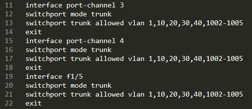
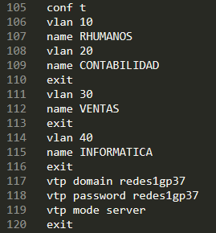
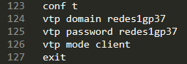
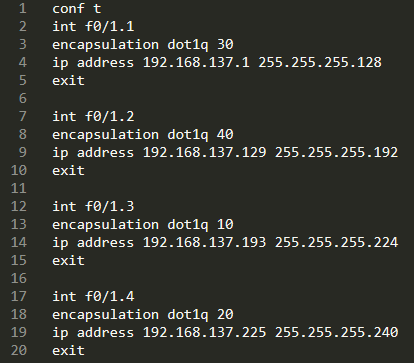
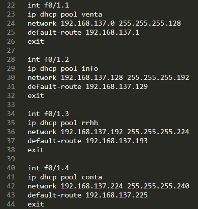
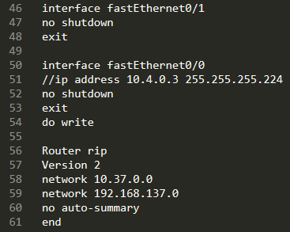
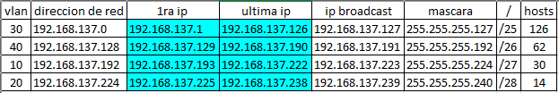

Proyecto Grupo 37

***
#### Integrantes
|   Carné   |               Nombre              |
| --------- | --------------------------------- |
| 201500332 | Gabriela Xiomara Raymundo Barrios |
| 201700532 | Milton Josue Villeda Gómez        |
| 201503378 | Escarleth Andrea Velasco Campos   |

***

## Topología 3:

- ## Equipos

- admin 1 (vpc)
- admin 2 (vpc)
- Ventas  (máquina virtual)
- Contabilidad (máquina virtual)
- Informatica (máquina virtual)
- Recursos Humanos (máquina virtual)

## Vlans utilizadas 

- Informática: 20
- Contabilidad: 50
- Ventas: 30
- Administrador: 10
- Recursos Humanos: 40

## Configuración de VLANS

## Configuracion de puertos troncales y acceso

## Configuracion VPCS con dhcp

## Configuracion ip virtuales

## Configuración de redes

- Administrador: 192.168.137.240/29
- Ventas: 192.168.137.0/25
- Informática 192.168.137.128/26
- Contabilidad 192.168.137.224/28
- Recursos Humanos 192.168.137.192/27

## Topología 2

### configuración de port channel

### Permitir vlans

### Router modo servidor

### Router modo cliente

### Configuración router-vlan

### Configuración dhcp

### Configuración router rip

### Configuración sub redes

